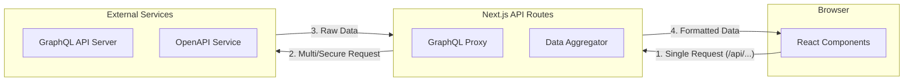

# BFF (Backend For Frontend) Pattern in Next.js

이 프로젝트는 Next.js의 **API Routes**를 활용하여 **BFF(Backend For Frontend)** 패턴을 구현하고 있습니다. BFF는 프론트엔드 요구사항에 최적화된 전용 백엔드 계층을 의미하며, 보안 강화와 성능 최적화에 핵심적인 역할을 합니다.

## 1. 개요 (Overview)

클라이언트(브라우저)가 외부 API(GraphQL, OpenAPI 등)와 직접 통신하는 대신, Next.js 서버가 중간에서 **프록시(Proxy)** 및 **데이터 가공(Transformation)** 역할을 수행합니다.

### 왜 BFF 패턴을 사용하나요?

- **보안 (Security)**: 민감한 API 엔드포인트와 API 키를 브라우저에 노출하지 않습니다.
- **성능 (Performance)**: 여러 번의 API 호출을 서버에서 병렬로 처리하여 클라이언트 통신 횟수를 줄입니다 (Aggregation).
- **최적화 (Optimization)**: 프론트엔드 UI에 필요한 데이터만 정제하여 전송함으로써 네트워크 비용을 절감합니다.

---

## 2. 주요 구현 사례

### 🔒 전역 GraphQL 보안 프록시

- **파일**: [pages/api/graphql/proxy.ts](/pages/api/graphql/proxy.ts)
- **역할**: 외부 GraphQL 백엔드 주소를 숨기고 모든 요청을 서버를 통해 전달합니다.
- **적용**: `ApolloProvider`의 `uri`를 `/api/graphql/proxy`로 설정하여 전역적으로 보호됩니다.

### 🚀 데이터 병합 및 정제 (Aggregation)

- **파일**: [pages/api/market/aggregation-example.ts](/pages/api/market/aggregation-example.ts)
- **역할**: 다수의 쿼리 또는 API에 분산된 데이터를 서버 사이드에서 한 번에 가져와(Aggregation) 결합한 뒤 클라이언트에 전달합니다.
- **적용 상세**:
  - 클라이언트가 '상품 상세 정보'와 '현재 사용자의 컨텍스트(내 상품인지 여부 등)'를 알아내기 위해 두 번 API를 호출하면 **네트워크 워터폴(Network Waterfall)** 현상이 발생할 수 있습니다.
  - 이 예제에서는 Next.js API Route(BFF)가 `Promise.all`을 사용하여 두 개의 별도 GraphQL 쿼리를 **병렬 동시 호출**합니다.
  - 응답받은 데이터들을 프론트엔드 UI가 파싱하기 가장 이상적인 형태의 단일 JSON 객체(`aggregatedData`)로 조합하여 응답합니다.
  - **결과**: 클라이언트 렌더링 블로킹 시간 단축, 불필요한 HTTP 커넥션 및 배터리 로드 감소.

### 🎨 UI 맞춤형 데이터 가공

- **파일**: [pages/api/market/bff-example.ts](/pages/api/market/bff-example.ts)
- **역할**: 백엔드의 복잡한 객체를 UI 컴포넌트([MarketBFFExample.tsx](/src/features/market/ui/list/MarketBFFExample.tsx))가 바로 쓸 수 있는 형태(`priceTag`, `thumbnail` 등)로 포맷팅하여 전달합니다.

---

## 3. 구조도 (Architecture)

---

## 4. 보안 주의사항

- **환경 변수**: API 키나 비밀번호는 클라이언트 사이드(`NEXT_PUBLIC_`) 변수가 아닌 서버 사이드 전용 환경 변수에 저장하여 BFF 계층에서만 사용하십시오.
- **에러 핸들링**: 백엔드의 상세 에러 메시지가 클라이언트에 그대로 노출되지 않도록 서버 측에서 에러를 정제하여 반환하십시오.

## 5. 💡 심층 분석: BFF 아키텍처 도입의 진정한 가치 (Masterpiece Guide)

최신 소프트웨어 아키텍처가 거대한 모놀리식(Monolithic) 시스템에서 마이크로서비스(MSA)로 전환됨에 따라, 프론트엔드는 단일 화면을 그리기 위해 수많은 백엔드 서비스와 복잡하게 얽혀 통신해야 하는 무거운 짐을 떠안게 되었습니다. 이러한 맥락에서 BFF(Backend For Frontend)는 프론트엔드 최적화를 위한 가장 강력하고 필수적인 디자인 패턴으로 자리 잡았습니다.

### 🎯 1. REST API 환경에서의 BFF: "생존을 위한 필수 전략"

전통적인 REST API 환경에서 프론트엔드는 태생적으로 겪는 두 가지 치명적인 딜레마가 있습니다. 바로 **Over-fetching(오버패치)**과 **Under-fetching(언더패치)**입니다.

- **Over-fetching (네트워크 오버헤드와 렌더링 지연)**: 리스트 화면에서 '상품 제목'과 '가격'만 필요한데, 백엔드의 REST 엔드포인트는 상세 설명, 작성자 정보, 전체 댓글 배열, 생성/수정일 등 수십 개의 필드가 포함된 거대한 JSON을 강제로 반환합니다. 이는 특히 모바일 환경에서 심각한 데이터 요금 낭비와 자바스크립트 스레드의 파싱 부하를 초래합니다.
- **Under-fetching과 N+1 요청 문제 (Network Waterfall)**: 커머스 메인 화면 하나를 완성하기 위해 클라이언트는 `/api/users/me`, `/api/recommendations`, `/api/cart/count` 등 최소 3~4번의 API 호출을 순차적으로 보내야 합니다. 하나가 완료되어야 다음을 요청할 수 있는 폭포수 현상은 치명적인 로딩 지연(LCP 저하)을 만듭니다.

**✨ BFF의 해결책**:
BFF가 이런 중간 계층에 등판하면 기적이 일어납니다. 복잡한 MSA 서비스들에 대한 요청을 서버 사이드에서 **병렬(Parallel)로 수집(Aggregation)**하고, **정확히 UI 컴포넌트 렌더링에 필요한 필드만 추출(Filtering)**하여 완벽하게 정제된 하나의 JSON 객체로 조립합니다. 프론트엔드 앱은 브라우저에서 **단 1번의 가벼운 요청**만으로 완벽한 초기 상태를 확보할 수 있습니다.

### 🌐 2. GraphQL 환경에서의 BFF: "한계를 보완하는 든든한 방패"

_"GraphQL 자체가 이미 Over/Under-fetching을 해결해주지 않나요?"_
정확한 지적입니다. GraphQL은 클라이언트가 원하는 데이터 구조를 선언적으로 쿼리할 수 있어 REST API의 태생적 한계를 극복했습니다. 본 프로젝트처럼 백엔드가 이미 GraphQL인 환경에서, 과연 BFF가 여전히 필요할까요? **대답은 "절대적으로 예(Yes)" 입니다.**

1.  **🚀 보안 프록시 및 엔드포인트 은닉 (Security & Masking)**
    - **리스크**: 프론트엔드 코드나 브라우저 개발자 도구의 네트워크 탭에 진짜(Origin) GraphQL Endpoint URL이 직접 노출되는 것은 극도로 위험합니다. 악의적인 해커가 Introspection 기능을 통해 전체 DB 스키마 구조를 훔치거나, 리소스 고갈 공격(Infinite Depth Query 등)으로 백엔드 DB를 마비시킬 수 있습니다.
    - **해결책**: 브라우저에는 오직 내 프론트 서버 주소와 통신하는 `/api/graphql/proxy` 경로만 노출시킵니다. 물리적으로 분리된 BFF 서버가 뒷단에서 실제 외부 도메인 백엔드와 안전하게 터널링합니다. 여기서 헤더(Header) 검증, 인증 토큰(Secret) 주입, 쿼리 복잡도 제한 정책을 수행하여 철통보안을 완성합니다.

2.  **🧩 이기종 데이터 어그리게이션 (Heterogeneous Aggregation)**
    - **리스크**: GraphQL 하나만으로 세상의 모든 API를 묶을 수는 없습니다. 메인 백엔드 서비스(GraphQL) 데이터와 인증/결제 서비스(REST 통신을 하는 Third-Party API), 사내 별도 Microservice 간 등 각기 다른 프로토콜의 조합이 자주 필요합니다.
    - **해결책**: `aggregation-example.ts`가 그 위력을 보여줍니다. 서로 다른 백엔드 컨텍스트의 호환성을 BFF 서버 단계에서 하나의 흐름으로 융합(Orchestration)하고 일관된 프론트엔드 친화적인 데이터 포맷으로 통일시킵니다. 클라이언트의 자바스크립트는 지저분한 이기종 통신 로직으로부터 완전히 자유로워집니다.

3.  **⚡ 렌더링 특화 비즈니스 로직 이관 (UI Transform & Cache)**
    - 날짜 포맷팅("방금 전", "2일 전"), 다국어 번역 주입, 긴 텍스트의 말줄임표 처리 같은 'UI 표현 규칙'을 프론트 브라우저에서 수행할 경우, 각 컴포넌트마다 연산이 들어갑니다.
    - BFF는 이를 대신해 미리 렌더링하기 직전 상태의 데이터(View Model)로 전부 가공해버립니다. 더불어, GraphQL은 POST 메서드 기반이므로 브라우저 HTTP 캐싱이 매우 어렵다는 한계가 있는데, 별도 BFF API를 REST의 단순 `GET` 형태로 열어두면 Next.js의 Edge Cache나 CDN의 캐싱의 축복을 다시 누릴 수 있게 됩니다.

### 📱 3. 결론: 프론트엔드 권력의 확장 (Front-end Empowerment)

**"BFF는 백엔드 개발자의 일이 아닙니다. 프론트엔드 개발자가 자유를 얻기 위한 도구입니다."**

과거 프론트엔드는 백엔드가 내려주는 API 구조에 화면을 우겨넣고 맞춰야 하는 종속적인 입장이었습니다. 하지만 `Next.js API Routes`와 같은 강력한 풀스택 프레임워크 기능의 도입으로, 프론트엔드 엔지니어는 화면과 가장 가까운 곳에 **'나만을 위한 맞춤형 경량 백엔드 역할(BFF)'**을 스스로 정의하고 조율할 수 있게 되었습니다.

이것이 단순한 아웃소싱 통신망을 넘어, 강력한 성능 최적화와 결속 없는 독립성을 지향하는 현대 웹 아키텍처의 필수 교양, BFF 패턴의 진정한 마스터피스입니다.
